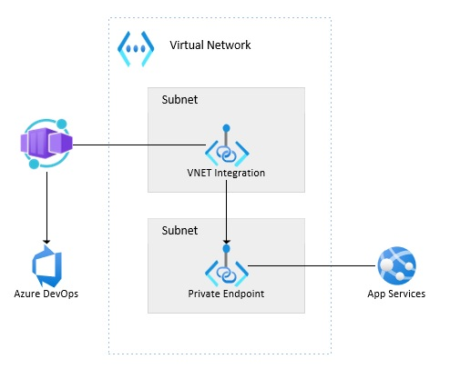
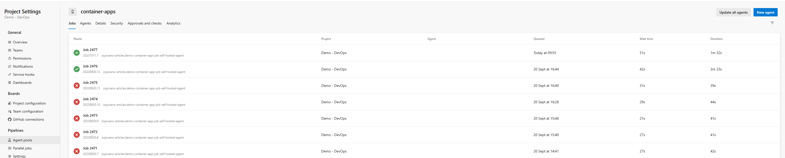
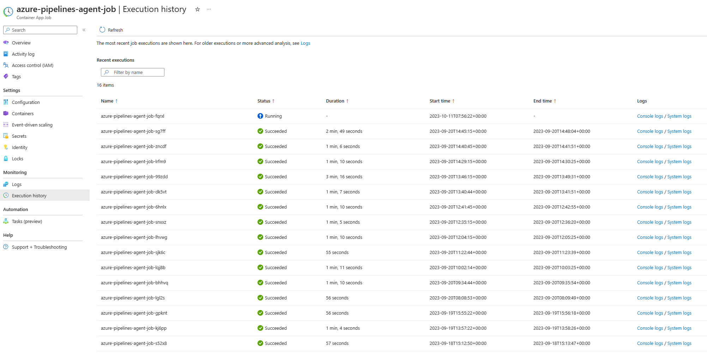
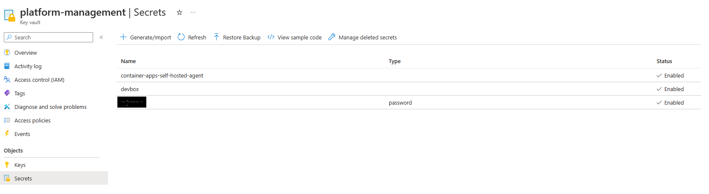

# Sample - ADO Self-hosted agent as a Container App job

Demo of ADO pipeline self-hosted agent running as Azure Container Apps - Job

## Overview

ADO self-hosted agent running as a Container Apps Job. Container Apps is integrated with a VNET with App Service Private Endpoint(s). Public Access for the App Service is disabled and deployments to App Service can be done only through the Private Endpoint(s).



ADO self-hosted agent agent pool jobs:


Container Apps Job execution history.


## How to deploy the sample

The sample is based on the [tutorial for the Container Apps Job self-hosted agent](https://learn.microsoft.com/azure/container-apps/tutorial-ci-cd-runners-jobs?pivots=container-apps-jobs-self-hosted-ci-cd-azure-pipelines&tabs=powershell).
Besides the deployment of Container Apps Environment and Container App Job, this sample also deploys App Service with a Private Endpoint in order to demonstrate ADO Pipeline deployment to App Service with Private Endpoint.

### Pre-requisites

- Owner of Azure Subscription
- Azure DevOps organization: If you don't have a DevOps organization with an active subscription, you can create one for free.
- Azure KeyVault available to store a ADO PAT token

### Deployment

- Follow steps in the [tutorial](https://learn.microsoft.com/en-us/azure/container-apps/tutorial-ci-cd-runners-jobs?pivots=container-apps-jobs-self-hosted-ci-cd-azure-pipelines&tabs=powershell#create-a-new-agent-pool) and create new ADO agent pool

- Follow steps in [tutorial](https://learn.microsoft.com/en-us/azure/container-apps/tutorial-ci-cd-runners-jobs?pivots=container-apps-jobs-self-hosted-ci-cd-azure-pipelines&tabs=powershell#get-an-azure-devops-personal-access-token) to create personal access token for target ADO organization and add the token as a secret to a Azure KeyVault. The sample code retrieves the token from the KeyVault when creating the Container Apps Job. 


- (Optional) If you would like to customize self-hosted agent container, you would need to git clone sample repository https://github.com/Azure-Samples/container-apps-ci-cd-runner-tutorial.git used in this sample and create your own repository so that you can modify Docker build file. 
Replace ACR Build parameter with your own git repository:

```bash
az acr build `
  --registry "$CONTAINER_REGISTRY_NAME" `
  --image "$CONTAINER_IMAGE_NAME" `
  --file "Dockerfile.azure-pipelines" `
  "https://github.com/Azure-Samples/container-apps-ci-cd-runner-tutorial.git" # https://github.com/zojovano-demos/container-apps-ci-cd-runner-tutorial.git
```

- Run createcontainerapp.ps1 to:
   - Create Container App Job
   - Build self-hosted agent container image
   - Create VNET
   - Create App Service with Private Endpoints to previously created VNET

## References

- https://learn.microsoft.com/en-us/azure/container-apps/tutorial-ci-cd-runners-jobs?pivots=container-apps-jobs-self-hosted-ci-cd-azure-pipelines&tabs=powershell
- https://learn.microsoft.com/en-us/azure/container-apps/vnet-custom-internal?tabs=bash%2Cazure-cli&pivots=azure-cli
